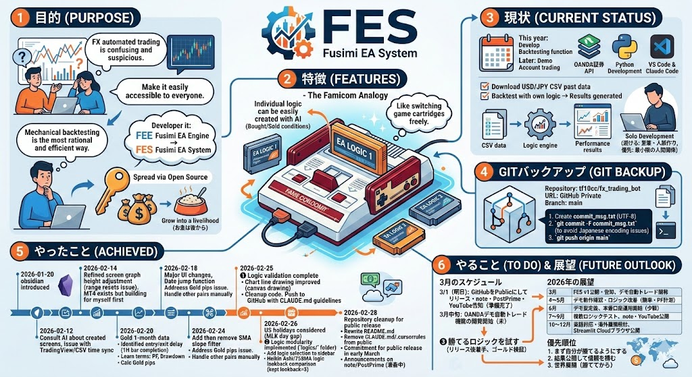

# FES — Fushimi EA System



FX取引の**過去検証（バックテスト）ツール**です。
CSVデータとロジックファイルを用意するだけで、様々な売買ルールを検証できるオープンソースツールです。

---

## 特徴

- **ロジックを差し替え可能** — `logics/` フォルダに `.py` ファイルを置くだけで新しい売買ルールを追加できます（ファミコンのカセット方式）
- **複数銘柄対応** — USD/JPY・EUR/USD・ゴールドなど、ファイル名から自動判定
- **インタラクティブチャート** — TradingView Lightweight Charts でエントリー・決済ポイントを視覚確認できます
- **標準搭載ロジック** — 平均足 + 75SMA手法（R氏手法）

---

## 画面イメージ

- チャート上にエントリー▲▼マーカーを表示
- マーカーをクリックするとエントリー・決済の価格ラインを表示
- サイドバーでCSV選択・ロジック選択・スプレッド設定
- 損益サマリーと取引一覧テーブル

---

## セットアップ

### 1. リポジトリをクローン

```bash
git clone https://github.com/tf10cc/fx_trading_bot.git
cd fx_trading_bot
```

### 2. 仮想環境を作成・有効化

**Windows:**
```bash
python -m venv .venv
.\.venv\Scripts\Activate.ps1
```

**Mac/Linux:**
```bash
python -m venv .venv
source .venv/bin/activate
```

### 3. ライブラリをインストール

```bash
pip install -r requirements.txt
```

### 4. CSVデータについて

サンプルデータ（ゴールド2026年1月分）が同梱されており、クローン直後からすぐ動作確認できます。

追加の過去データを使いたい場合は `data/` フォルダに置いてください。

対応フォーマット：
- **Forex Tester形式**: `TICKER`, `DTYYYYMMDD`, `TIME` カラムあり
- **OANDA形式**: `UTC` カラムあり
- **標準形式**: `time` カラムあり

### 5. ロジックデータについて

サンプルロジック（平均足 + 75SMA手法）が同梱されており、クローン直後からすぐ使えます。

追加のロジックを使いたい場合は `logics/` フォルダに `.py` ファイルを置いてください。

### 6. 起動

`■run_streamlit_lightweight.bat` をダブルクリックしてください。

ブラウザで `http://localhost:8501` が開きます。

> コマンドラインから起動する場合：
> ```bash
> streamlit run streamlit_app_lightweight.py
> ```

---

## ロジックの追加方法

`logics/` フォルダに `.py` ファイルを置くだけで、画面のドロップダウンに自動表示されます。

### テンプレート

```python
# logics/my_logic.py

NAME = "マイロジック"  # 画面に表示される名前

def check_long_entry(df, idx):
    """ロングエントリー条件（Trueを返すとエントリー）"""
    # df には以下の列が使えます
    # close, open, high, low  — 通常ローソク足
    # ha_color (1=青/−1=赤), ha_body_top, ha_body_bottom  — 平均足
    # sma  — 75SMA
    return False

def check_short_entry(df, idx):
    """ショートエントリー条件"""
    return False

def check_long_exit(df, idx):
    """ロング決済条件"""
    return False

def check_short_exit(df, idx):
    """ショート決済条件"""
    return False
```

### 標準搭載ロジック

| ファイル | 内容 |
|---------|------|
| `logics/heikin_ashi_75sma.py` | 平均足 + 75SMA手法（R氏手法） |

---

## pip換算の仕様

ファイル名から自動判定します。

| 銘柄 | 倍率 | 判定キーワード |
|------|------|--------------|
| Gold / Silver / 原油など | × 1（USD） | gold, xau, silver, xag, oil, wti |
| USD/JPY などJPYペア | × 100（pips） | jpy |
| EUR/USD などその他 | × 100（pips） | デフォルト |

---

## OANDAライブシグナル（開発予定）

> ⚠️ 現在未実装・開発予定の機能です。

---

## ライセンス

MIT License — コピー・改変・商用利用 自由。
ただし **FES（Fushimi EA System）** の著作権表示を残してください。
